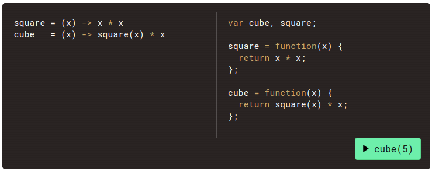
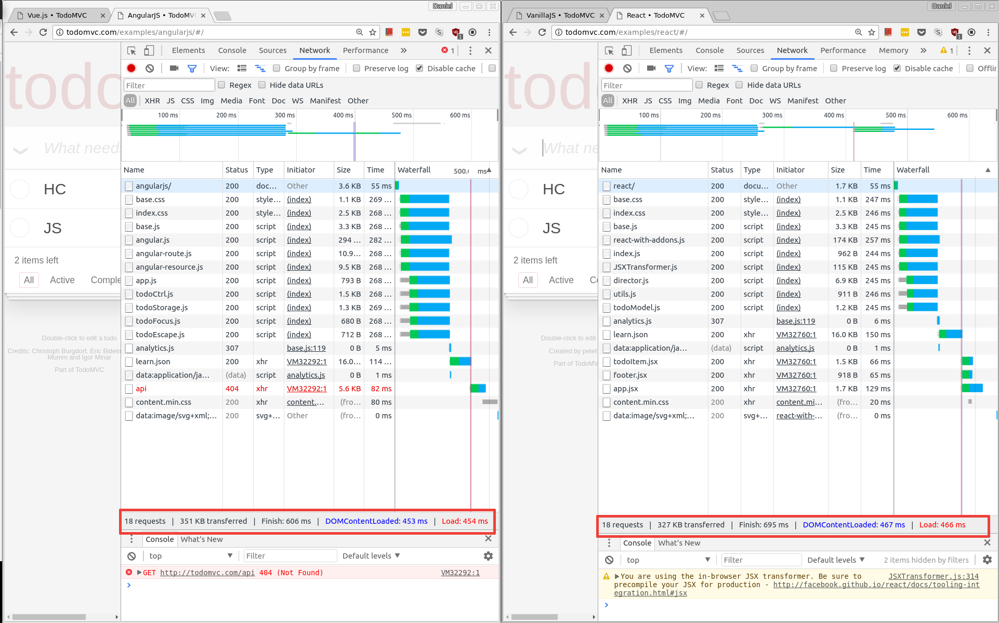
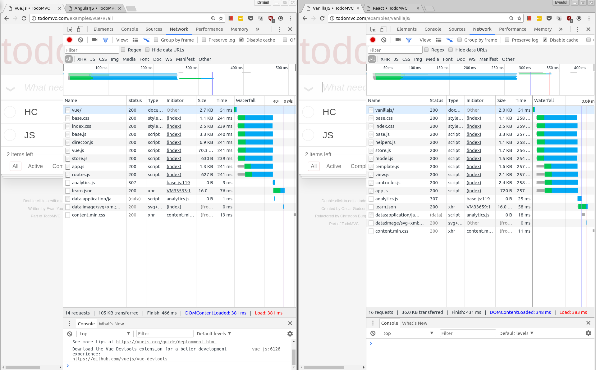
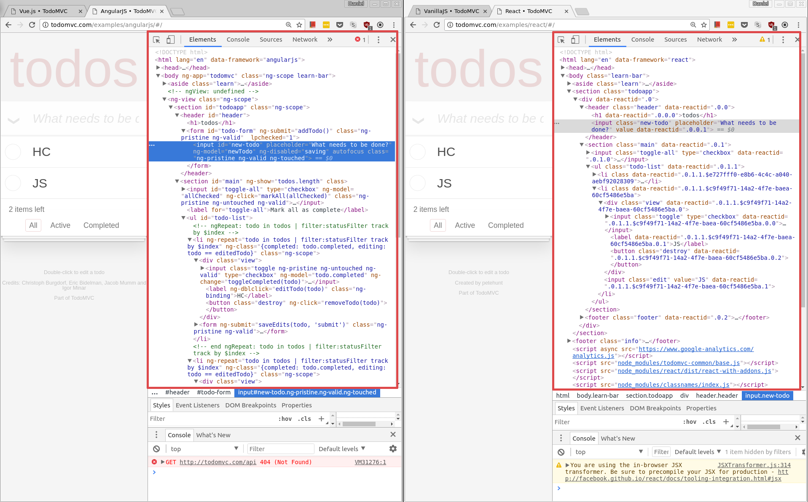
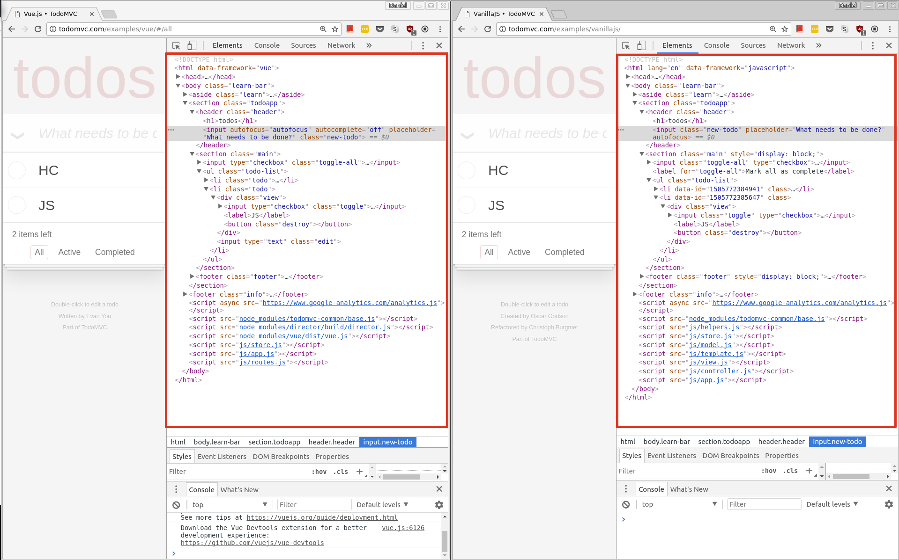

---

# JavaScript Arrow Functions
Daniel Chen

---

Also known as fat arrows `=>`

---

It comes from CoffeeScript's function expression `->`

---

# Process of solving a coding challenge
seems time consuming, but provides more robustness in the long run

---
# Outline

1. Coming up with the list of requirements
2. Choosing the framework for the job
3. Write test based on the requirements
4. Write the production code
---
# Requirements

- Functionality

Note:
- store login data in database
- retrieve data from database
- validate login data, return pass or fail

---
# Requirements

- Functionality
- Layout

Note:
- provide 2 text fields, login, password
- provide registration button
- provide login button
---
# Requirements

- Functionality
- Layout
- Validation

Note:
- display warning "user name required" if field is left empty
- display warning "password required" if field is left empty
- display warning "Incorrect user name or password" if invalid user/pass combination
---
# Requirements

- Functionality
- Layout
- Validation
- Accessibility (a11y)

Note:
- Label controls: WAI-ARIA, title, label element
- Show comprehensive errors
- Validate input
- Notify users of success, loading, or failed task and how to correct mistakes
- screen readers
---
# Requirements

- Functionality
- Layout
- Validation
- Accessibility (a11y)
- User Experience (UX)
    - a11y and UX go hand in hand. Keeping a11y in mind will improve your UX coverage.

Note:
- does the cursor auto focus on username on page load?
- can you navigate and submit with the keyboard only?
- should you keep username on failed attempts?
- Is it easy to click on the input fields?
- is the intention of the component clear?
- are the error messages comprehensive?
---
# Requirements

- Functionality
- Layout
- Validation
- Accessibility (a11y)
- User Experience (UX)
    - a11y and UX go hand in hand. Keeping a11y in mind will improve your UX coverage.
- Security

Note:
- Security is in layers. Data is inputted, transmitted and is stored. Each layer has to be scrutinized.
- can someone see the credentials when typed in?
- can someone sniff the credentials across the wire?
- can someone access the credentials where they are stored?
    - is the password saved in plain text?
    - Is there any way someone can access the database without going through our login?
- can someone bypass the login? whatever information is protected by the login, can anyone else access it without being authenticated?

---
**Requirements external resources**
- [UMN homework trivia-4](https://www.d.umn.edu/~gshute/cs4531/programming/trivia-4/user-login.xhtml)

**a11y**
- [w3.org forms](https://www.w3.org/WAI/tutorials/forms/)
- [cantina.co form errors screen readers can access](https://cantina.co/form-errors-screen-readers-can-access/)
- [webaim.org form validation](http://webaim.org/techniques/formvalidation/)
- [Stanford screen reader testing](https://soap.stanford.edu/tips-and-tools/screen-reader-testing)
- [Claws Firefox add-on](https://addons.mozilla.org/en-US/firefox/addon/claws/) screen reader emulator for firefox
---
## Choosing Framework
Figure out project limitations:
    - time
    - money
    - personnel (people and skills)
External resources explaining differences in frameworks
- [lullabot - Choosing the right js framework](https://www.lullabot.com/articles/choosing-the-right-javascript-framework-for-the-job)
- [tutsplus - Noob guide to choosing a js framework](https://webdesign.tutsplus.com/tutorials/the-noobs-guide-to-choosing-a-javascript-framework--cms-28538)
- [@ZombieCodeKill - Choosing a js framework](https://medium.com/@ZombieCodeKill/choosing-a-javascript-framework-535745d0ab90)

Note:
Frameworks are not very different nowadays.
---
[@ZombieCodeKill - Choosing a js framework](https://medium.com/@ZombieCodeKill/choosing-a-javascript-framework-535745d0ab90)
    "Rob says that to be honest all of these frameworks are very fast because 50 frames per second is faster than what we can usually see."

Note:
Audiophile analogy
    - the chain from source to destination
    - for the most part, unless you do side by side comparison, the framework itself won't be the limiting factor, instead it would be whether your code is optimized.

react got virtualDOM popular, now everyone has it.

---
## Framework difference at the DOM (Document Object Model)
[ToDoMVC](http://todomvc.com/)

Note:
Click the link. Explain what it is
---
Angular 1 vs React Network Speed

---
Vue vs Vanilla Network Speed

---
Angular 1 vs React DOM

---
Vue vs Vanilla DOM

---
## Criterias I would consider

- What the team knows best
- What the framework exceeds at if you only need that particular feature
- Really, mostly just team preference, people still use COBOL, Fortran, etc
---
## Iterate
minimum refactor count
`prototype -> make robust -> optimize`
---
**Prototyping**
- Minimize cost
- Identify the fewest requirements that expresses the idea to the user
- Focus on speed

**Make robust**
- Focus on adding necessary features per user request and code organization

**Optimize**
- Focus on code organization and optimization

Note:
sometimes a mix of frameworks or low level code will give you more bang for the buck if puzzled correctly.
---
## Writing Tests
Many options out there, just choose one. Most are able to do what you need or can use plugins.

- mochajs
    - mochajs + (should, expect, chai, better-assert, unexpected)
- jasmine
- jest
- many more
---
## Unit/Functional tests
- store login data in database
- retrieve data from database
- validate login data, return pass or fail
---
## Writing code (Finally!)
---
Or so I hoped...
---
## 01 - how naive
---
- How do I use sqlite3 with node?

Note:
Realization that I don't know how to do things.
---
- how do I use sqlite3 with node?

Go through documentation and StackOverflow

[01- the database](https://github.com/danielim/login-talk/tree/master/01)

Note:
open db.js
Wrote code before test because tutorials show code. Tried to get it working before I tested it.
open db.test.js
---
## 02 - How do I test the code instead of testing the test?
---
Modules
[02 - Modules](https://github.com/danielim/login-talk/tree/master/02)
---
## 03 - Oh, I forgot to validate users

- added those functions
- cleaned up db.serialize() where not needed
- made `'` into `"`
[03 - Continuation and Cleanup](https://github.com/danielim/login-talk/tree/master/03)
---
## main - How do I unit test express? HTTP requests
[Express](https://github.com/danielim/login-talk/tree/master/)

Note:
In an ideal world, the 4 steps would be all you need. Technical debt and other constraints cause you to shift from your ideal process. Be accepting of changes in the process as long as they don't hinder other teammates. Otherwise make sure to communicate these changes.
---
How do you test validating a user on submit if the database is unpopulated?
---
The front-end login component is HTML only. I'll add other frameworks to the mix as this project matures. You are more than welcome to contribute to examples that can use this backend.
---
**Contact:**
    Twitter: @imdanielch
    LinkedIn: https://www.linkedin.com/in/imdanielch
    GitHub: https://github.com/danielim/
    This talk available at:
        https://github.com/danielim/login-talk
---
# Questions?
---
Final thought: Make things. I learned more by creating this talk than I would have just reading and watching tutorials for weeks.
---
