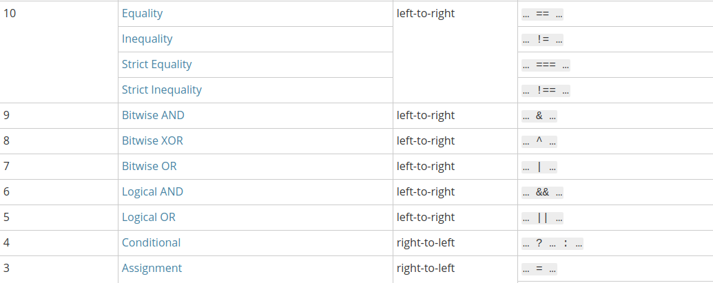

---

# Operators and Conditionals
Daniel Chen

---

# Operators
Symbols or keyword representing an action

# Operand
Object to be manipulated

---

* Assignment
* Comparison
* Arithmatic
* Logical
* String
* Conditional
* etc

## Resource:
[MDN: Expressions and Operators](https://developer.mozilla.org/en-US/docs/Web/JavaScript/Guide/Expressions_and_Operators)

---

# Assignment

`operand1 operator operand2`

Assign value of `y` to `x`
```javascript
x = y
```

---

# Assignment

shortcuts
```javascript
x += y
```
is the same as
```javascript
x = x + y
```

---

# Comparison
```javascript
x == y
x === y
x > y
x >= y
x < y
x <= y
```
etc

---

# Comparison (more)
* [Equality comparisons and sameness](https://developer.mozilla.org/en-US/docs/Web/JavaScript/Equality_comparisons_and_sameness)
* [Kyle Simpson presentation](https://www.youtube.com/watch?v=ZZmDYaXQFWk) HillCountry JS meetup 10/21/2013

(take opinion with a grain of salt. Style, optimization, technical debt, organizational resources and protocols)

---

# Logical
[MDN: Expressions and Operators#Logical](https://developer.mozilla.org/en-US/docs/Web/JavaScript/Guide/Expressions_and_Operators#Logical)

---

# Logical operator chains

```javascript
true && false || true
```

---

# Operator Precedence


---

# Resources
* [MDN: Operator Precedence](https://developer.mozilla.org/en-US/docs/Web/JavaScript/Reference/Operators/Operator_Precedence)
* [MDN: Logical Operators](https://developer.mozilla.org/en-US/docs/Web/JavaScript/Reference/Operators/Logical_Operators)

---

```javascript
'cat' && null || 'dog'
true || false && true || false
```
[MDN: Short-circuit Evaluation](https://developer.mozilla.org/en-US/docs/Web/JavaScript/Reference/Operators/Logical_Operators#Short-circuit_evaluation)

---

# Exercise

I have a plate, Mary said she might bring oranges, Peter said he might bring Apples. How do I make sure my plate has food if any of them bring food, and if both of them bring food, I get both oranges and apples?

```
// psudo-code, this won't run well in JavaScript

var mary = ?
var peter = ?
var plate =
```

---

```javascript
var plate = (mary && peter) || mary || peter;
```

This doesn't make much sense because plate would be assigned Peter's apples if
```javascript
mary && peter
```
resolves to true.

---

# Conditionals

code which defines decision making.

---

# Logic Examples
* if you behave, then you can eat ice cream.
* if you pass your exams, you can go out and play.
* if you don't pay your taxes, you'll be fined.
* if it's sunny but not too hot, we'll go play outside.
* if the player's hearts are empty, the player is dead.

---

* If ... else
* switch
* ternary operator

---

# If ... else

```javascript
if(condition1){
  // then do thing 1
} else if (condition2){ // otherwise if
  // then do thing 2
} else { // otherwise
  // do something else
}
```

---

# Switch

```javascript
switch(expression){ // given the expression
  case choice1: // if expression = choice1
    // run this code
    break; // break so code doesn't continue running into the next case.
  case choice2: // if expression = choice2
    // run this code
    break; // break so code doesn't continue running into the next case.
  ...
  default:
    // if no cases match the expression, run this code
}
```

---

# Ternary operator

```javascript
( condition ) ? run this code : otherwise run this code
```

---

[MDN: Conditionals](https://developer.mozilla.org/en-US/docs/Learn/JavaScript/Building_blocks/conditionals)

---

# Exercise
You have 2 switches that operate a light bulb. The moment you flip a switch, the light bulb should toggle. Write a script which tells us the state of the lightbulb depending on what state switch A and switch B are.

```javascript
var lightBulb;
var switchA = false;
var swithcB = false;
```

---

# Questions?

---

**Contact:**

- Discord: https://discord.gg/sCK2Q29
- Slides available at:
https://github.com/danielim/presentations/tree/operators-conditionals

---
