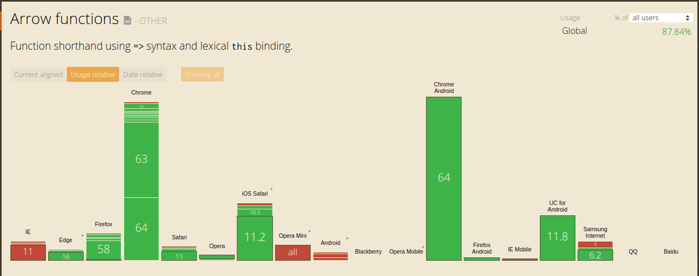

---

# JavaScript Arrow Functions
Daniel Chen

---

Also known as fat arrows
```javascript
=>
```

---

It was inspired by CoffeeScript's function expression
```coffeescript
->
```

[CoffeeScript Function Documentation](http://coffeescript.org/#functions)

---
### Why isn't there a -> version of arrow functions?
The motivation for => was to address the oft-fired footgun of dynamic this bindings. Additionally, having two forms of arrows is confusing; So only one form was added.

---

# Why was it proposed?

2 purposes

1. Simplify `this` binding as opposed to traditional Function Expression.
2. Shorter syntatical form.

[TC39wiki - Arrow Function](http://tc39wiki.calculist.org/es6/arrow-functions/)

---

# What is `this`?
[An introduction to "this" keyword in JavaScript by Zac Gordon](https://www.youtube.com/watch?v=2qMKjWf1KdE)

more info:

[Binding "this" in JavaScript by Zac Gordon](https://www.youtube.com/watch?v=73aAyap_88w)

[An Example of Binding "this" in JavaScript with addEventListener() by Zac Gordon](https://www.youtube.com/watch?v=sxRnmKldiBs)

[THIS keyword - Beau teaches JavaScript by freeCodeCamp](https://www.youtube.com/watch?v=eOI9GzMfd24)

---

# Syntax

```javascript
var square = function(x){
  return x * x;
}

var square = x => x * x;
var square = (x) => x * x;
var square = (x) => { return x * x };
```
[Arrow Functions - Beau teaches JavaScript by freeCodeCamp](https://www.youtube.com/watch?v=22fyYvxz-do)

---
The first section `var square` is a variable assignment of the function expression
---
The middle section `x`, or `(x)` are the parameters. Parentheses are required only if there are more than 2 parameters.
---
The last section is the function definition `x * x` or `{ return x * x }`. Curly braces are not necessary if you plan on returning a single statement.
---

## When to use them

[When should I use Arrow functions in ECMAScript 6?](https://stackoverflow.com/questions/22939130/when-should-i-use-arrow-functions-in-ecmascript-6)

## When not to use them

- When you need to bind `this` to something other than the scope it was declared in.

[When not to use an arrow function by Wes Bos](http://wesbos.com/arrow-function-no-no/)

---

# Browser Compatibility


from
[caniuse.com arrow functions](https://caniuse.com/#search=arrow%20functions)

---
# Bundling and Transcribing
Alternatively you can use `babel.js` to transcribe your ES6 javascript to ES5 for increased compatibility.
A common method would be to use `webpack` to bundle your javascript and during bundling, it runs `babel.js` to transcribe your code.

---

# Further reading
- [MDN Arrow Functions](https://developer.mozilla.org/en-US/docs/Web/JavaScript/Reference/Functions/Arrow_functions)
- [Function Declaration vs Function Expression](https://javascriptweblog.wordpress.com/2010/07/06/function-declarations-vs-function-expressions/)
- [Named function expression demystified by Juriy "kangax" Zaytsev](http://kangax.github.io/nfe/)

---

# Questions?

---

**Contact:**

- Discord: https://discord.gg/sCK2Q29
- Slides available at:
        https://github.com/danielim/presentations/tree/js-fat-arrow

---
